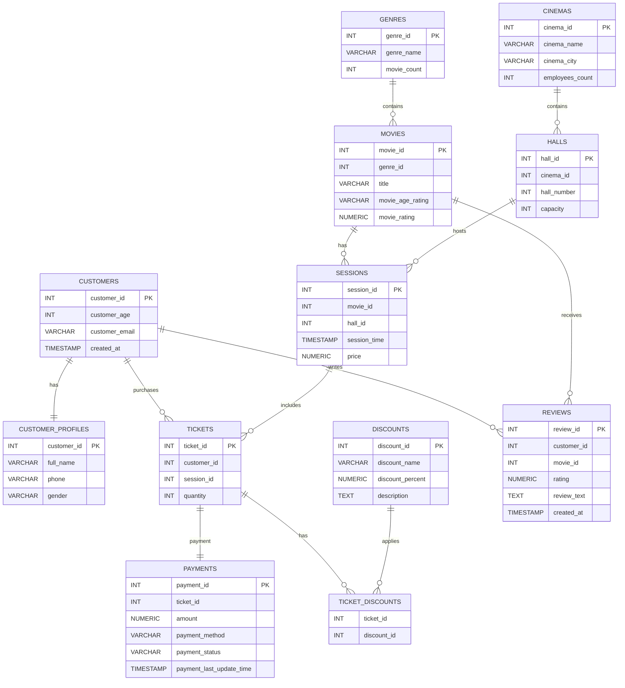

# CS301_Practical_Assignment_4

I created an operational PostgreSQL database for managing a cinema network.

The goal of this assignment is to practice:

- database design
- relationships (1:1, 1:many, many:many)
- constraints
- indexes and query optimization
- EXPLAIN ANALYZE
- SQL views
- SQL stored procedures
- SQL triggers and functions
- users, roles and privileges

## Created tables

- customers – stores customer information
- customer_profiles – stores additional customer details
- genres – stores movie genres
- movies – stores movie information
- cinemas – stores cinema information
- halls – stores cinema halls
- sessions – stores movie sessions
- tickets – stores purchased tickets
- payments – stores payment information
- discounts – stores available discounts
- ticket_discounts – many-to-many relationship between tickets and discounts
- reviews – stores customer reviews for movies
  

## Database features

- Primary keys and foreign keys
- One-to-one, one-to-many and many-to-many relationships
    - One-to-one relationship (customers ↔ customer_profiles)
    - One-to-many relationships (genres → movies, cinemas → halls, movies → sessions, halls → sessions, customers → tickets, sessions → tickets, tickets → payments, customers → reviews, movies → reviews)
    - Many-to-many relationship (tickets ↔ discounts through ticket_discounts)
- Constraints (PRIMARY KEY, FOREIGN KEY, UNIQUE, CHECK)
- Indexes for query optimization
- Query performance comparison using EXPLAIN ANALYZE
- SQL View for displaying movie reviews with rating greater than 4
- Stored procedure for updating session price
- Trigger and function for automatically updating the number of movies in each genre
- Three database users with different privileges:
  - Cashier
  - Local cinema manager
  - Global manager

### Database Schema

This is the database schema for the project.

This is the ERD:

